<!-- ### GLOBAIS ########################################################## -->

```{r setup, include=FALSE}
options(htmltools.dir.version = FALSE)
knitr::opts_chunk$set(comment = "#>")
library(magrittr)
```


<!-- ### ABERTURA ######################################################### -->

# Quem Somos

A _Curso-R_:
- O grupo surgiu em 2015 para ministrar o curso "Programação em R: do
casual ao avançado" no IME-USP
- Em 2016 e 2017, ministramos novamente o curso e, depois de mais de 100 alunos
formados, decidimos aumentar a gama e a frequência das aulas

Caio:
- Bacharelando em Ciência da Computação pelo IME-USP
- Estagiário na Platipus Consultoria
- Metido a designer, maníaco da organização e metade texano

Fernando:
- Bacharel e mestrando em Estatística pelo IME-USP
- Diretor-técnico na Associação Brasileira de Jurimetria
- Nerd, Estatístico e mágico

---
# Prólogo

O termo mais apropriado para tratar de *web scraping* em portugês é "raspagem
web", ou seja, a extração de dados provenientes de uma página online.

Quando se trata de web scraping, a primeira coisa que precisamos fazer é criar
um plano de ação. Raspar dados online não é uma ciência exata, então se não
nos planejarmos com antecedência é bem provável que no final nosso código
fique completamente incompreensível e irreprodutível.

### Expectativa

```
dados <- raspar("site.com")
```

### Realidade

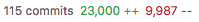

---
# Prólogo (cont.)

Por isso recomendamos sempre tentar seguir o **fluxo do web scraping**:


Nós achamos que o fluxo do web scraping é a melhor forma de abordar esse conteúdo
porque, com ele, a tarefa muitas vezes complicada e sem objetivo definido de
raspar dados da web se torna um processo iterativo e bem delimitado que podemos
utilizar nas mais diversas situações.

---
# Conteúdo

Através de exposição, exemplos do mundo real e exercícios veremos cada passo do
fluxo:

- Como **identificar** o objeto de interesse

- Como funciona uma página HTML e como **navegar** por seus elementos

- O protocolo HTTP e como **replicar** seu funcionamento

- Como **parsear** as páginas baixadas

- Como **iterar** ao longo de muitas páginas e como salvar esses resultados

- Como **validar** resultados e evitar os problemas mais comuns do web scraping

- Outras tecnlogias associadas ao web scraping moderno

- Captchas (quando quebrá-los e como quebrá-los)


<!-- ### IDENTIFICAR ###################################################### -->

---
class: inverse, center, middle
# IDENTIFICAR

---
# Quando usar/não-usar web scraping

### Quando usar:

- Quando precisamos coletar um volume grande de dados da internet

### Quando não usar:

- Quando temos uma forma mais simples de obter os dados (API, base de dados, etc.)

- Quando os termos de uso do site não nos permitem fazer isso

- Quando o `robots.txt` do site não nos permite fazer isso

- Quando houver risco de derrubar ou comprometer a estabilidade do site

- Quando as informações do site não são públicas

---
# Encontrar o que você quer

Imagine que você precisa extair alguma informação de um site, seja ela o título
de várias páginas da Wikipédia, os comentários de um post do Reddit ou mesmo
os dados de países contidos no famosíssimo *Example Web Scraping Website*
([http://example.webscraping.com/](http://example.webscraping.com/)).

Se tivermos verificado que de fato não temos nenhuma outra opção e que o site
nos permite raspá-lo, então podemos começar.

O primeiro passo do fluxo consiste em **identificar** os elementos que queremos
extrair e observar se eles se comportam da mesma forma em todas as situações
possíveis.

### Example Web Scraping Website

O nosso site de exemplo será o `http://example.webscraping.com`. Para que
possamos continuar, precisamos salvar manualmente uma página de interesse desse
site (no caso, a home já basta).

---
# Outros casos interessantes

### Extração de textos

Talvez uma das tarefas mais simples de se cumprir em web scraping é extrair
texto bem-estruturado de uma página. Os artigos da Wikipédia são ótimos para
treinar um primeiro scraper, mas eles acabam sendo uma excessão no mundo do
web scraping justamente por serem tão bem estruturados.

Além disso, a Wikipédia possui uma API.

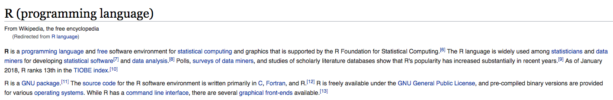


---
# Outros casos interessantes (cont.)

### Extação de imagens

Baixar imagens já uma tarefa um pouco mais complexa porque elas geralmente estão
menos organizadas que texto e ainda por cima ocupam mais espaço.

A imagem abaixo é do Reddit, que também possui uma API.

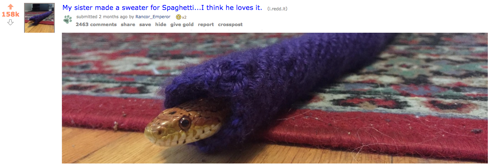

---
# Outros casos interessantes (cont.)

### Extração de PDFs

Extrair PDFs é um pouco mais complicado do que extrair imagens porque eles
geralmente não estão endereçados na página da mesma forma que o resto do conteúdo.
Além disso, eles são uma das formas mais pesadas de mídia que podemos raspar.

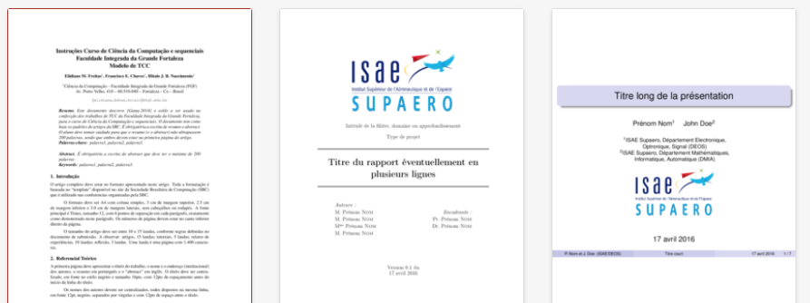

---
# Outros casos interessantes (cont.)

### Extação de áudio

Dificilmente temos a necessidade de baixar arquivos de áudio, mas, quando esse é
o caso, o fluxo não muda muito em relação aos PDFs. A dificuldade aqui é em como
tratar esses arquivos porque geralmente são escassos os métodos e bibliotecas de
processamento de som.

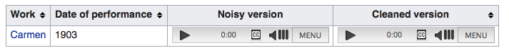


<!-- ### NAVEGAR ########################################################## -->

---
class: inverse, center, middle
# NAVEGAR


---
# HTML

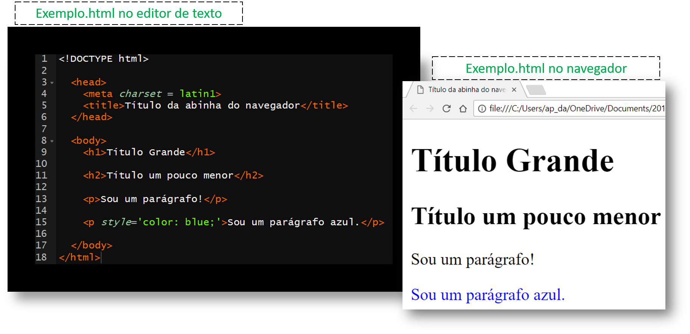

---

# HTML

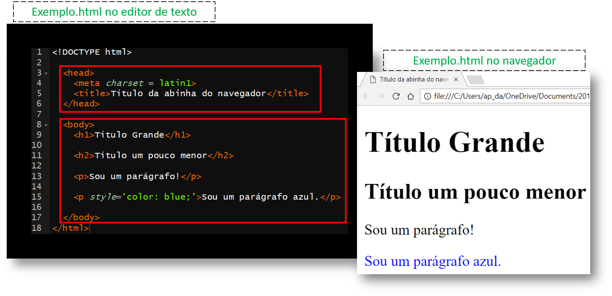

---
# HTML

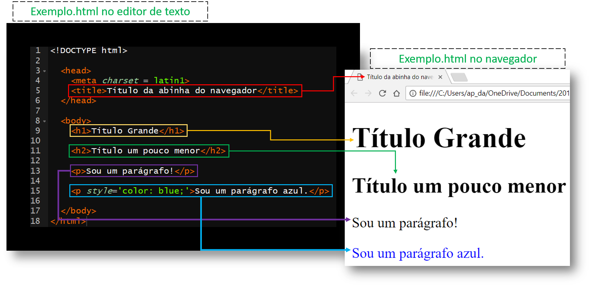

---
# HTML


 - tags: head, meta, title, body, h1, h2, p, html.
 - atributos: charset, style.


---
# HTML

### Um pouco de teoria:

1) Todo HTML se transforma em um **DOM** (document object model) dentro do navegador.

2) Esse **DOM** pode ser representado como uma árvore em que cada nó é:
    - ou um **atributo**
    - ou um **texto**
    - ou uma **tag**
    - ou um **comentário**

3) Utiliza-se a relação de pai/filho/irmão entre os nós.

---
# HTML


---
# HTML

Ex: coletando todas as tags `<p>`'s

```{r}
library(rvest)
read_html("static/html_exemplo.html") %>% html_nodes("p")
```

Exercício: relacione a saída do código com o desenho de árvore. Identifique os ramos que foram selecionados.

---
# HTML

Exercício: utilize as funções `html_attrs()` e `html_text()` para extrair informações dos nodes selecionados.

```{r}
library(rvest)
read_html("static/html_exemplo.html") %>% html_nodes("p") %>% html_attrs
```


---
# HTML


---
# CSS

CSS (Cascading Style Sheets) descrevem como os elementos HTML devem se apresentar na tela. Ele é responsável pela aparência da página.

```{html}
<p style='color: blue;'>Sou um parágrafo azul.</p>
```

O atributo `style` é uma das maneiras de mexer na aparência utilizando CSS. No exemplo,

- `color` é uma **property** do CSS e 
- `blue` é um **value** do CSS.

[Existe uma lista imensa de **properties/values** de CSS](https://www.w3schools.com/cssref/default.asp).

---
# CSS

A maneira mais comum de se usar CSS é por meio de um arquivo a parte `.css`.

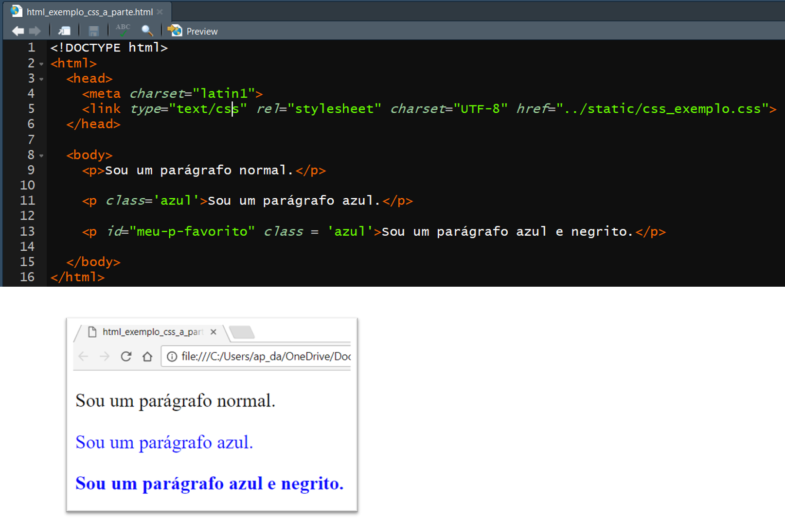


---
# CSS

A maneira mais comum de se usar CSS é por meio de um arquivo a parte `.css`.


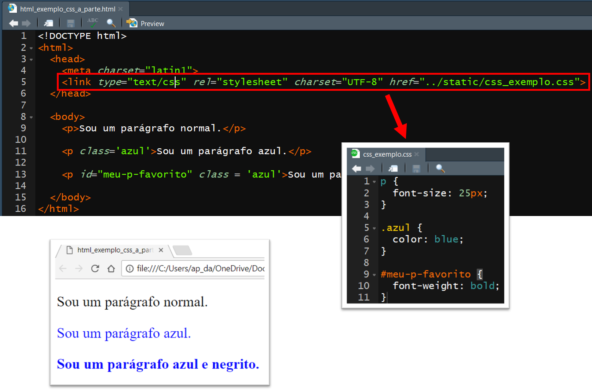


---
# CSS

O CSS sabe onde deve "estilizar" por meio dos **CSS Selectors**.

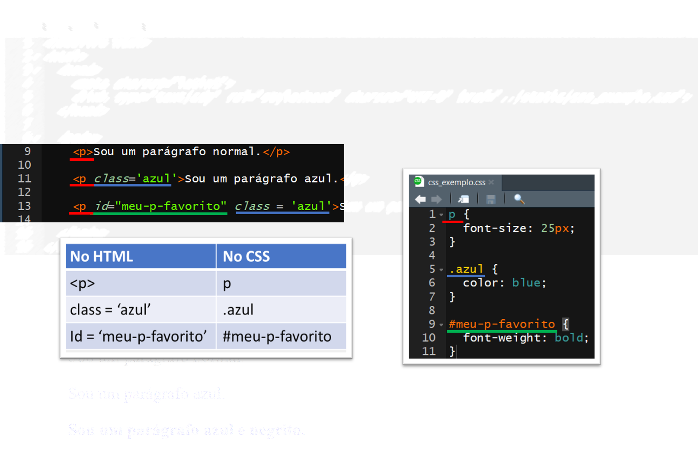

Se os nodes forem **encontrados** pelo CSS, eles sofrerão as mudanças descritas.

---
# CSS Selectors

> "OK, legal, CSS estiliza a página, mas pra que raios eu preciso saber disso para webscraping?"

Em Webscraping estamos interessados em usar os **CSS Selectors** para selecionar os elementos do HTML que precisamos. O jeito com que o CSS "embeleza" a página não nos interessa aqui!

No exemplo vimos três seletores:

- seletor de tag (`p`)
- seletor de classe (`.azul`)
- seletor de id (`#meu-p-favorito`)

O link abaixo possui a lista de todos os seletores:

[w3schools.com/cssref/css_selectors](https://www.w3schools.com/cssref/css_selectors.asp)


---
# CSS Selectors

No R, utilizamos os **CSS Selectors** para selecionar os nodes:

```{r, eval=FALSE}
html <- read_html("static/html_exemplo_css_a_parte.html")

html %>% html_nodes("p")
html %>% html_nodes(".azul")
html %>% html_nodes("#meu-p-favorito")
```

---
# CSS Selectors

**Dica:** às vezes é difícil conseguir encontrar o CSS Selector que filtra exatamente o que queremos. Uma ferramenta útil é o 

**CSS Selector Gadget** do Chrome

### Vamos ao chrome...

---
# XPATH - outra forma de fazer seleção

### Apenas para conhecimento...

**XPath** é uma alternativa ao **CSS Selector**. O **XPath** faz tudo o que o **CSS Selector** faz e mais um pouco, mas é raro precisar dele.

O link abaixo possui a lista de todos os seletores **XPath**:

[w3schools.com/xml/xpath_syntax](https://www.w3schools.com/xml/xpath_syntax.asp)


---

x xml2 para encontrar coisas (salvar arquivo + read_html)

x xml_find(_all)?


---
# Inspect


x Exemplo 1:
 - Inspect Texto

x Exemplo 2:
 - Inspect Imagem


<!-- ### REPLICAR ######################################################### -->

---
class: inverse, center, middle
# REPLICAR

---
# protocolo HTTP

- requests/responses

---
# Requests

- GET
- POST

---
# Requests

### GET


---
# Requests

### POST


---
# Responses
   - o que tem na resposta
       - cookies
       - html
       - status
       
---
x Network (como que eu vejo as requests acontecendo)
x httr (como fazer requisições em R)
x httr exemplo: GET e POST
x httr o que vem na resposta
x abrir o html pra ver se deu certo


<!-- ### PARSEAR ########################################################## -->

---
class: inverse, center, middle
# PARSEAR

---
# PARSEAR

- Definição de "Parsear"

---
# xml2

x extraindo texto
x select tag do texto
x xml_text
x download de imagem
x tidy output

---
# BREAK (mais ou menos por aqui começa um exemplo)

x example site
o exercícios
 1. logar numa conta (fazer o POST)
 2. baixar a página de andorra
 3. extrair os dados de andorra numa tabela


<!-- ### ITERAR ########################################################### -->

---
class: inverse, center, middle
# ITERAR

---
x baixar html
x salvar tidy output
x carefully
x walk    
o exercício
 1. baixe as páginas de todos os países
 IP BLOCK (os caras vão ter que dar ip 1)
TALVEZ OUTRO (OU O PRIMEIRO) BREAK POSSA ACONTECER AQUI


<!-- ### VALIDAR ########################################################## -->

---
class: inverse, center, middle
# VALIDAR

---
x Event validation e view state (asp)
 - TODO: PENSAR EM OUTRO EXEMPLO
x Páginas jsp
 - TODO:  PENSAR EM OUTRO EXEMPLO
x Evitar armadilhas (catpchas, etc)
 - bloqueio de IP
 - Hackear a URL (comentar)


<!-- ### MISCELÂNEA ####################################################### -->

---
class: inverse, center, middle
# MISCELÂNEA

---
x paralelização e distribuição
x Interatividade
x JS (V8, etc)
x Selenium, phantom
x RMouse


<!-- ### CAPTCHAS ######################################################### -->

---
class: inverse, center, middle
# CAPTCHAS

---
x Modelos ad hoc
x lendo a imagem no R (pacote de ler jpeg ou wtv)
x interpretando o conteudo
x filtrando com magick
x tesseract
o exercíco
 1. faça uma conta automaticamente
x Modelos keras
 - TODO: EXPLICA OU NÃO?
x decryptr


